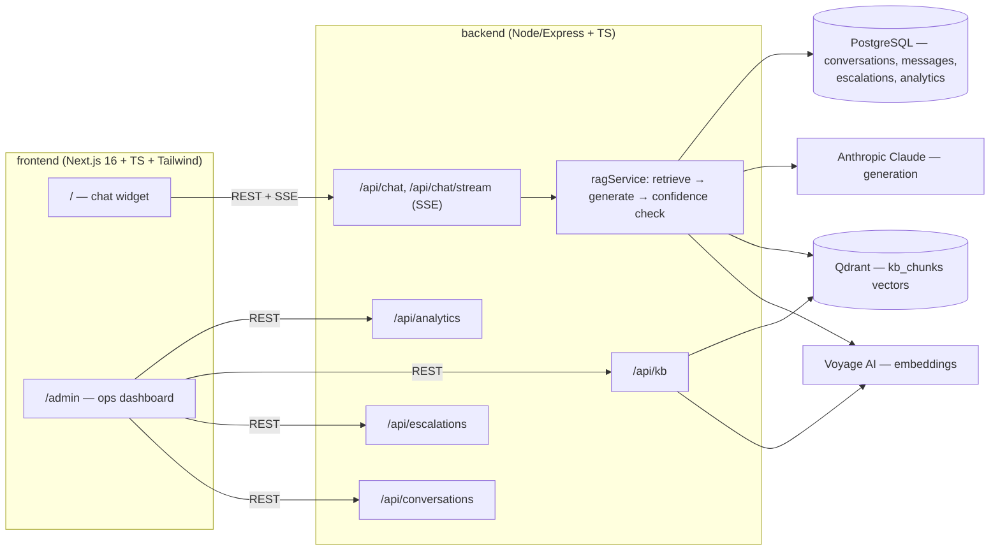

# AI Customer Support Agent

A RAG-based support chat that answers customer questions from your knowledge base,
auto-escalates anything it isn't confident about to a human agent, and gives ops a
live dashboard of resolution rate, volume, and unanswered questions.

## Architecture



**RAG flow**: customer message → embed query (Voyage) → top-k similarity search in
Qdrant → build a context-augmented prompt → Claude returns structured JSON
`{answer, confidence, needs_human, citations}` → if `needs_human` or confidence is
below `CONFIDENCE_ESCALATION_THRESHOLD`, the conversation is marked `ESCALATED` and
queued for a human agent; otherwise the answer streams back over SSE. Every turn is
logged to `analytics_events` for the dashboard.

## Stack

| Layer       | Choice                                  |
|-------------|------------------------------------------|
| Frontend    | Next.js 16 (App Router), TypeScript, Tailwind |
| Backend     | Node.js, Express, TypeScript              |
| Generation  | Anthropic Claude (Messages API)           |
| Embeddings  | Voyage AI (`voyage-3-lite`)                |
| Relational DB | PostgreSQL via Prisma                   |
| Vector store | Qdrant                                   |
| Validation  | Zod                                        |
| Tests       | Vitest                                     |

## Project layout

```
backend/
  prisma/schema.prisma   Customer, Conversation, Message, KbDocument, Escalation, AnalyticsEvent
  src/services/          embeddingService, vectorStore, claudeService, ragService, ingestionService
  src/routes/            chat, conversations, escalations, kb, analytics
  src/middleware/        errorHandler, auth (admin bearer token), rateLimiter, requestLogger
  data/kb/*.md           seed FAQs: order status, password reset, refunds, subscriptions
  scripts/seed.ts         chunk → embed → upsert the seed KB into Qdrant
frontend/
  src/app/page.tsx        customer chat widget
  src/app/admin/page.tsx  ops dashboard (conversations, escalation queue, analytics, KB upload)
docker-compose.yml        postgres + qdrant + backend + frontend
```

## Running locally

### 1. Configure environment

```bash
cp .env.example .env
```

Fill in `ANTHROPIC_API_KEY` and `VOYAGE_API_KEY`. Note `DATABASE_URL` uses port
**5433** on purpose — this avoids clashing with a Postgres instance that may already
be running natively on your machine on the default 5432.

### 2. Start the datastores

```bash
docker compose up -d postgres qdrant
```

### 3. Install deps, migrate, seed

```bash
cd backend
npm install
npx prisma migrate deploy   # applies the committed migration in prisma/migrations
npm run seed                # chunks data/kb/*.md, embeds via Voyage, upserts into Qdrant
```

### 4. Run the apps

```bash
# backend
cd backend && npm run dev        # http://localhost:4000

# frontend (separate shell)
cd frontend && npm install && npm run dev   # http://localhost:3000
```

Visit `http://localhost:3000` for the chat widget and `http://localhost:3000/admin`
for the ops dashboard (enter the `ADMIN_API_TOKEN` from your `.env` when prompted).

### Or run everything in Docker

```bash
docker compose up -d --build
```

### Tests

```bash
cd backend && npm test
```

## Verifying the escalation path

- Ask a seeded FAQ ("How do I reset my password?") → expect a direct, cited answer,
  conversation status `AUTO_RESOLVED`.
- Ask something out of scope or sensitive ("can you delete my production database?")
  → expect low confidence, conversation status `ESCALATED`, and the item shows up in
  `/admin` under the escalation queue.

## Production hardening roadmap

This build is functionally complete but intentionally leaves the following for a
real production deployment:

- **RBAC / SSO** — `src/middleware/auth.ts` is a single shared bearer token for all
  admin routes; swap for per-user roles (support agent vs. admin vs. read-only).
- **Observability** — structured logs exist (`pino`), but there's no tracing/APM
  wired up (OpenTelemetry + a backend like Honeycomb/Datadog) to debug latency or
  failures across the retrieval → generation pipeline.
- **Conversation analytics** — the `/api/analytics` endpoints are a starting point;
  a real deployment would want cohort/trend views and CSAT capture.
- **Multilingual support** — the prompt and KB are English-only; would need
  language detection and either multilingual embeddings or per-language KB.
- **Human-in-the-loop approval** — currently escalation just queues the conversation;
  a production system would let an agent approve/edit AI-drafted replies before send
  for borderline-confidence cases, not just the lowest ones.
- **Continuous evaluation** — no automated golden-set eval exists yet to catch
  regressions in answer quality as the KB or prompt changes over time.
- **Rate limiting** — `rateLimiter.ts` is in-memory and per-instance; move to a
  shared store (Redis) before running multiple backend replicas.
